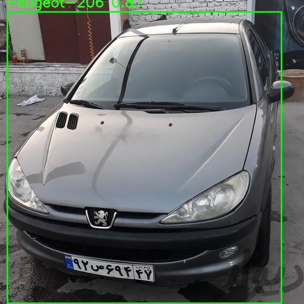

# Iranian Car Detection


## Train 

To train YOLOv5 with your custom dataset and use the model in Python scripts, follow these steps:

### 1. Install YOLOv5
```bash
git clone https://github.com/ultralytics/yolov5
cd yolov5
pip install -r requirements.txt
```

### 2. Prepare Dataset Structure
Ensure your dataset follows this structure:

```
yolov5/
├── data/
│   └── iranian-cars.yaml (your dataset config file)
├── datasets/
│   ├── train/
│   │   ├── images/
│   │   └── labels/
│   ├── valid/
│   │   ├── images/
│   │   └── labels/
│   └── test/
│       ├── images/
│       └── labels/
```

### 3. Train the Model
Run this command from the yolov5 directory:
```bash
python train.py --img 640 --batch 16 --epochs 100 --data ./data/iranian-cars.yaml --cfg models/yolov5s.yaml --weights yolov5s.pt --name iranian_cars --device 0
```

Parameters explanation:
- `--img 640`: Input image size
- `--batch 16`: Batch size (reduce if you get memory errors)
- `--epochs 100`: Number of training epochs
- `--data`: Path to your dataset config
- `--weights`: Pretrained weights
- `--device 0`: Use GPU 0 (remove for CPU)

### 4. Save the Trained Model
After training, the best model is automatically saved to:
`yolov5/runs/train/iranian_cars/weights/best.pt`


### 5.Training Metrics Log

This document provides a log of the training process, including loss values, precision, recall, mean average precision (mAP), and learning rates across multiple epochs. The table below captures key metrics from epoch 0 to epoch 19.

#### Training Metrics Table

| Epoch | Train Box Loss | Train Obj Loss | Train Cls Loss | Precision | Recall | mAP@0.5 | mAP@0.5:0.95 | Val Box Loss | Val Obj Loss | Val Cls Loss | LR0 | LR1 | LR2 |
|-------|--------------|--------------|--------------|-----------|--------|--------|-------------|-------------|-------------|-------------|------|------|------|
| 0     | 0.029752     | 0.017216     | 0.044642     | 0.052204  | 0.99543| 0.092053| 0.069513    | 0.0074322   | 0.0025939   | 0.028605    | 0.07002 | 0.0033311 | 0.0033311 |
| 1     | 0.019484     | 0.011727     | 0.040809     | 0.36735   | 0.37564| 0.23615 | 0.18769     | 0.0071434   | 0.0024565   | 0.027327    | 0.03969 | 0.0063346 | 0.0063346 |
| 2     | 0.017496     | 0.011097     | 0.037026     | 0.47352   | 0.42884| 0.28394 | 0.2243      | 0.0057269   | 0.0024342   | 0.027143    | 0.00903 | 0.009008  | 0.009008  |
| 3     | 0.016027     | 0.011104     | 0.036067     | 0.4752    | 0.45217| 0.40033 | 0.33215     | 0.0054337   | 0.0023839   | 0.026943    | 0.008515 | 0.008515  | 0.008515  |
| 4     | 0.014773     | 0.010564     | 0.032671     | 0.69246   | 0.45617| 0.55299 | 0.46768     | 0.0050268   | 0.0021885   | 0.025733    | 0.008515 | 0.008515  | 0.008515  |
| 5     | 0.013968     | 0.010239     | 0.029778     | 0.75747   | 0.55689| 0.64428 | 0.5471      | 0.0048111   | 0.0020525   | 0.026042    | 0.00802  | 0.00802   | 0.00802   |
| 6     | 0.01385      | 0.010062     | 0.028365     | 0.76277   | 0.56656| 0.64012 | 0.55655     | 0.0044781   | 0.0021039   | 0.027025    | 0.007525 | 0.007525  | 0.007525  |
| 7     | 0.01322      | 0.0097443    | 0.026224     | 0.80079   | 0.59794| 0.69828 | 0.61411     | 0.0045634   | 0.0019977   | 0.026165    | 0.00703  | 0.00703   | 0.00703   |
| 8     | 0.012651     | 0.009571     | 0.024953     | 0.79039   | 0.60317| 0.70958 | 0.63084     | 0.0043376   | 0.0020838   | 0.025602    | 0.006535 | 0.006535  | 0.006535  |
| 9     | 0.01248      | 0.0094008    | 0.023718     | 0.8004    | 0.62057| 0.72532 | 0.65015     | 0.0041919   | 0.0019356   | 0.025547    | 0.00604  | 0.00604   | 0.00604   |
| 10-19 | (Additional epochs data to be filled) |

### 6.Confusion Matrix


### 7. val batch


### 8. How To use:

```python
from detection import detect_cars
detect_cars("detect_cars('/home/reza/Downloads/206.jpeg")
```



Fusing layers... 
YOLOv5s summary: 157 layers, 7045186 parameters, 0 gradients, 15.9 GFLOPs
Adding AutoShape... 
Saved result to detected_206.jpg
('Peugeot-206', (14, 23, 555, 598))
'''shell